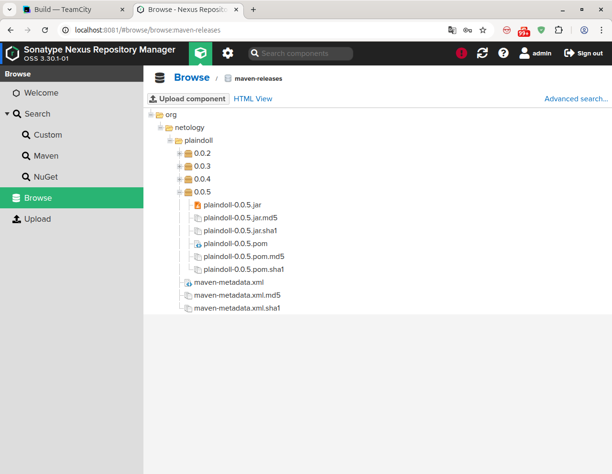
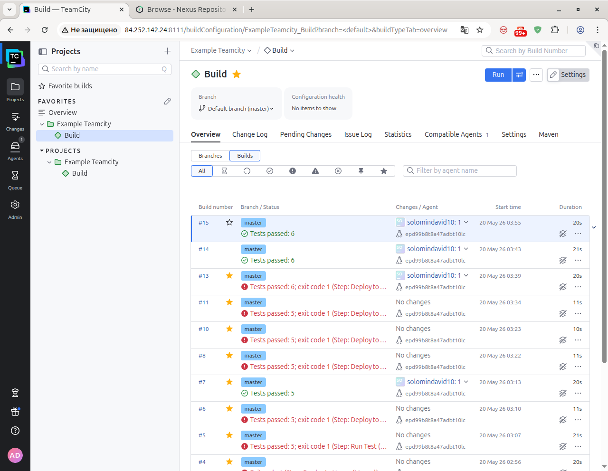
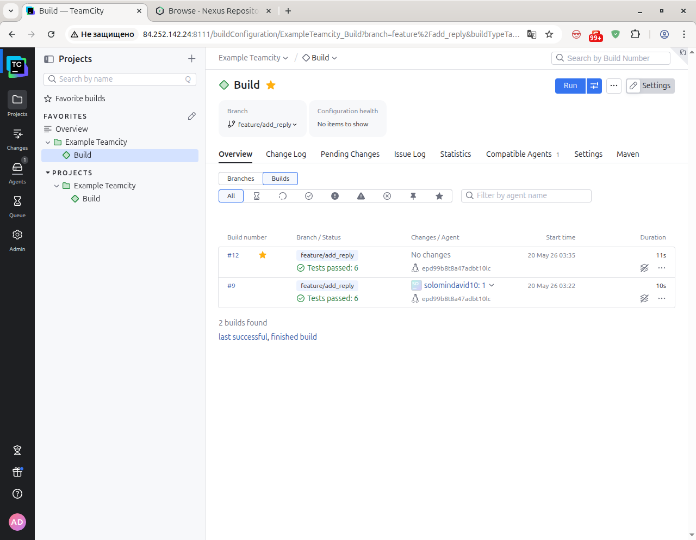

### CI/CD Pipeline: TeamCity + Maven + Nexus

Этот проект демонстрирует полный цикл CI/CD на базе TeamCity, Maven и Nexus Repository Manager.

Выполненные шаги
Создан новый проект TeamCity на основе fork‑репозитория.

Выполнен autodetect конфигурации сборки.

Настроены условия выполнения шагов:

`master` → `mvn clean deploy`

`feature‑ветки` → `mvn clean test`

Загружен `settings.xml` в Maven Settings TeamCity с учётом кредов Nexus.

В `pom.xml` обновлены ссылки на Nexus‑репозиторий.

Выполнена успешная сборка `master`, артефакт опубликован в Nexus.

Конфигурация TeamCity экспортирована в репозиторий (.teamcity/).

Создана ветка `feature/add_reply`.

Добавлен метод `reply()` с репликой, содержащей слово `hunter`.

Добавлен тест, проверяющий наличие слова `hunter`.

Изменения отправлены в ветку, сборка прошла успешно.

Выполнен `merge` в `master`, версия повышена до 0.0.5.

Артефакт plaindoll-0.0.5.jar подтверждён в Nexus.

